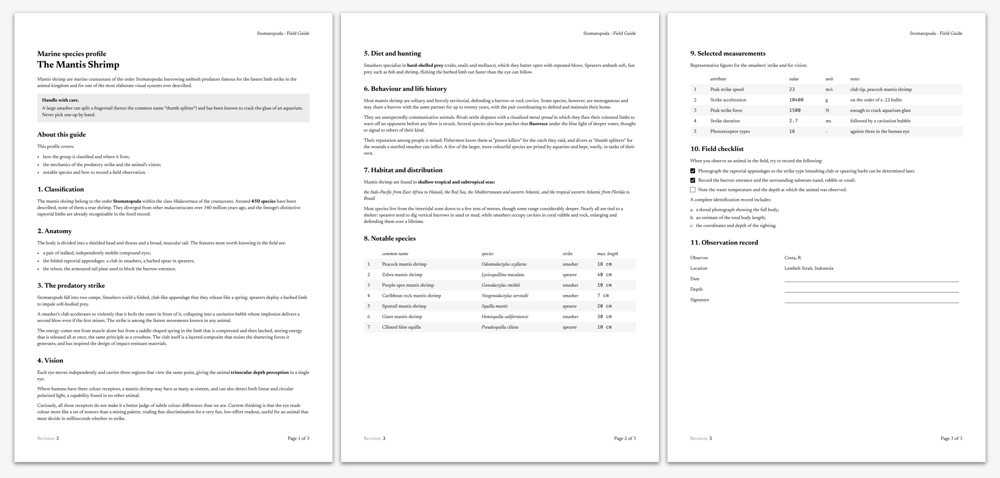

# textris-pdf

A lightweight, opinionated document renderer that builds a clean, **accessible
PDF** from Rust code, using a small imperative Rust API for content and plain
Rust code for the design. Output is a fully tagged **PDF/A-2A + PDF/UA-1** file:
archival-grade and navigable by screen readers.

It is built on [`krilla`](https://crates.io/crates/krilla) (PDF backend) and
[`harfrust`](https://crates.io/crates/harfrust) (text shaping and measurement).

The bundled example is a multi-page field guide to the mantis shrimp; see
[`tests/render_example.rs`](tests/render_example.rs) for the full document built
with the API and the generated `tests/mantis-shrimp-example.pdf` for the output.



## Quick start

```rust
use textris_pdf::build::{Textris, text, mono};
use textris_pdf::fonts::Fonts;

let fonts = Fonts::from_variable_files("regular.ttf", "italic.ttf", "mono.ttf")?;

let mut doc = Textris::new();
doc.h2("Marine species profile");
doc.h1("The Mantis Shrimp");
doc.paragraph("Mantis shrimp are marine crustaceans of the order Stomatopoda …");
doc.h3("1. Classification");
doc.paragraph(text("The mantis shrimp belong to the order ").bold("Stomatopoda"));
doc.table(
    ["", "common name", "max. length"],
    [[text("1"), text("Peacock mantis shrimp"), mono("18 cm")]],
);

doc.render_to_file("out.pdf", &fonts)?;
```

Regenerate the bundled sample (`tests/mantis-shrimp-example.pdf`) from the
command line:

```bash
cargo test --test render_example
```

## Architecture

The pipeline has decoupled stages, each in its own module and independently
testable:

```
build ─▶ model ─▶ layout ─▶ render ─▶ PDF
(API)  (Document) (pages)   (krilla)
```

| Module | Responsibility |
| --- | --- |
| [`build`](src/build/) | Imperative builder API for assembling a document from Rust |
| [`model`](src/model.rs) | Layout-agnostic document types (`Block`, `Inline`, `Table`, `TaskItem`, `Chrome`) |
| [`fonts`](src/fonts/) | Load fonts; shape and measure text with `harfrust` |
| [`layout`](src/layout/) | Turn blocks into positioned pages of drawing primitives (line breaking, tables, pagination) |
| [`render`](src/render.rs) | Paint the primitives into a tagged PDF with krilla; add the running header and footer, structure tree, metadata and outline |
| [`theme`](src/theme/) | Configurable design tokens (`Theme`): font sizes, colors, spacing, table/checkbox metrics, and per-table `TableStyle`s |

Two design choices worth knowing:

- **Shaping is done with `harfrust`, not krilla.** krilla can draw glyphs but
  keeps its font metrics private, so line breaking and column sizing need their
  own measurement path. We shape with HarfBuzz's official Rust port, built on
  the same fontations font-parsing stack krilla uses, so the widths we measure
  match exactly what krilla draws.
- **Layout is separated from PDF emission** by an intermediate display list
  (pages of `Text` / `Rect` / `Stroke` elements). This keeps the layout logic
  unit-testable without a PDF backend, and lets the renderer fill in the
  `Page N of M` counter once the total page count is known.
- **Accessibility is derived, not bolted on.** Alongside the display list, layout
  produces a logical structure tree (headings, paragraphs, lists, tables) in
  reading order and a heading outline. The renderer wraps every drawn run in a
  marked-content sequence — real content linked to its structure node, page
  furniture marked as an artifact — so the output is a valid tagged PDF. See
  [Accessibility](#accessibility).

## The builder API

Documents are assembled with [`Textris`](src/build/mod.rs):

| Method | Rendered as |
| --- | --- |
| `h1(text)` … `h5(text)` / `heading(level, text)` | Headings of decreasing size (`h1` largest) |
| `paragraph(text)` | A paragraph of flowing text |
| `boxed(\|b\| …)` | A boxed callout wrapping child blocks |
| `table(headers, rows)` / `table_with(..)` | Zebra-striped data table with italic headers |
| `label_table(rows)` | A label table (left labels, no striping); empty value cells become fill-in lines |
| `bullet_list(items)` | A plain bullet list |
| `ordered_list(items)` / `ordered_list_with(marker, items)` | A numbered or lettered ordered list |
| `task_list(items)` | Task list with filled / outlined checkboxes |
| `header_left/center/right(content)` | Running header shown on every page |
| `footer_left/center/right(content)` | Running footer shown on every page |
| `title(text)` / `language(tag)` | Document title and language for the PDF metadata (see [Accessibility](#accessibility)) |

Anywhere text is accepted you can pass a plain `&str` for a regular run, or build
mixed emphasis with the [`Text`](src/build/text.rs) builder and the `text` / `bold` /
`italic` / `mono` helpers, e.g. `text("Length: ").bold("18 cm")`.

Header and footer sections additionally accept
`SectionContent::page_counter(|page, total| …)` for a `Page N of M` counter,
filled in once the total page count is known.

## Markdown, docx

Besides the PDF pipeline there are structural exports, and a Markdown *input*
path, behind cargo features:

| Feature | Adds |
| --- | --- |
| `markdown` (default) | `Textris::to_markdown` / `write_markdown_to_file`: export as GitHub-flavored Markdown |
| `markdown-parser` | `Textris::push_markdown` / `markdown::parse_markdown`: author document bodies as Markdown text |
| `docx` | `Textris::to_docx` / `write_docx_to_file`: export as a Word file |

With `markdown-parser` enabled, a whole document can come from a (templated)
Markdown dialect string: the body as dialect blocks, and document chrome
(title, language, header/footer) as an optional `+++` front-matter block at the
top. Only the theme stays in Rust.

```rust
use textris_pdf::{build::Textris, markdown::ParseOptions};

let source = "\
+++
title = \"Observation form\"
language = \"en\"
header_right = \"Field guide\"
footer_right = \"Page {page} of {total}\"
+++

# Observation form

Record **one** animal per form.
";

let options = ParseOptions {
    numbered_heading_levels: vec![3], // `###` sections get "1.", "2.", …
    ..ParseOptions::default()
};
let mut doc = Textris::new();
doc.push_markdown(source, &options)?;   // applies the front-matter chrome too
doc.render_to_file("form.pdf", &fonts)?;
```

Chrome can equally be set on the builder in Rust; front matter just lets a
self-contained file carry it. A chrome value with `{page}` / `{total}`
placeholders becomes a page counter.

The body dialect is GitHub-flavored Markdown restricted to what the document
model can express, plus attribute lines (`{ striped = false, widths = "auto 4
3" }` binding to the next block) and directives (`@pagebreak`, `@spacer(2em)`);
underscore runs are fill-in lines (`___(120)` for an explicit width) and
`[#label]` references a heading's section number. The parser is strict:
unknown attributes, malformed tables and unterminated emphasis are errors with
a line number, not best-effort text. The full dialect reference lives in the
[`markdown::parse` rustdoc](src/markdown/parse.rs).
[`tests/mantis-shrimp-example-input.md`](tests/mantis-shrimp-example-input.md)
is a complete example: it re-authors the entire bundled field guide (chrome and
body) as dialect text, and a test asserts it parses back to the very same
document the builder produces.

The free [`markdown::parse_markdown`](src/markdown/parse.rs) function returns
body blocks only and rejects front matter (it has no document to apply chrome
to); use `Textris::push_markdown` for front matter.

When templating, interpolated data must pass through the crate's escape
functions (`markdown::escape`, `escape_cell`, `mono`, `mono_cell`) so
untrusted values can never change document structure; wire them up as the
template engine's auto-escaper and filters (askama: a custom escaper for the
`.md` extension; minijinja: `set_auto_escape_callback`). Never HTML-escape a
dialect template.

## Accessibility

Every document renders to a **tagged PDF** that conforms to both **PDF/A-2A**
(the accessible archival profile of PDF 1.7) and **PDF/UA-1** (the universal
accessibility standard). krilla validates against both while serializing, so a
successful render is a conformant file — a violation surfaces as a `RenderError`
rather than a silently broken document.

What that gives you, for free, from the ordinary builder calls:

- **Logical structure & reading order.** Headings (`H1`–`Hn`), paragraphs (`P`),
  lists (`L` → `LI` → `Lbl` + `LBody`) and tables (`Table` → `TR` → `TH`/`TD`,
  with header cells scoped to their column) are emitted as a structure tree in
  reading order, independent of where things land on the page.
- **Marked content everywhere.** Text is tagged content linked to its structure
  node; backgrounds, rules, checkboxes and the running header/footer are marked
  as artifacts and excluded from the reading order. A table header repeated atop
  a continuation page is tagged once and redrawn as an artifact, so assistive
  technology reads it a single time.
- **Metadata & navigation.** The document title (shown by viewers), language,
  and a creation date are written to the metadata, and a bookmark outline is
  built from the headings.

Set the title and language explicitly; both are required for full conformance
and improve the reading experience:

```rust
let mut doc = Textris::new();
doc.title("The Mantis Shrimp: A Field Guide");
doc.language("en"); // BCP 47 / RFC 3066 tag, e.g. "en", "en-GB", "nl"
```

If you leave the title unset it falls back to the first heading; the language
defaults to `"en"`.

## Fonts

textris-pdf bakes in **no typeface**; you supply your own. It works best with
**variable fonts**: a roman and a matching italic that share a weight axis, plus
a monospace face. The five logical styles are then derived by setting the `wght`
axis, so no separate bold/italic files are needed:

| Style | Face | `wght` |
| --- | --- | --- |
| `Regular` | roman VF | 400 |
| `Bold` | roman VF | 700 |
| `Italic` | italic VF | 400 |
| `BoldItalic` | italic VF | 700 |
| `Mono` | monospace | 400 |

Variation coordinates are applied both when embedding the font (krilla's
`Font::new_variable`) and before every shaping pass (`harfrust`), so measurement
and drawing always agree on the exact instance.

Three constructors, from most to least convenient:

```rust
use textris_pdf::fonts::{Fonts, FaceSource, WEIGHT};

// From files: roman + italic + mono, styles derived via `wght`.
let fonts = Fonts::from_variable_files("roman.ttf", "italic.ttf", "mono.ttf")?;

// From bytes embedded in the binary.
static ROMAN: &[u8] = include_bytes!("fonts/roman.ttf");
static ITALIC: &[u8] = include_bytes!("fonts/italic.ttf");
static MONO: &[u8] = include_bytes!("fonts/mono.ttf");
let fonts = Fonts::from_variable(ROMAN, ITALIC, MONO).unwrap();

// Fully general: pin every style to an arbitrary instance of any
// (variable or static) font.
let fonts = Fonts::from_faces(
    FaceSource::new(ROMAN).with_variation(WEIGHT, 350.0),
    FaceSource::new(ROMAN).with_variation(WEIGHT, 620.0),
    FaceSource::new(ITALIC).with_variation(WEIGHT, 350.0),
    FaceSource::new(ITALIC).with_variation(WEIGHT, 620.0),
    FaceSource::new(MONO),
).unwrap();
```

A `FaceSource` with no `.with_variation(...)` calls simply uses the font's
default instance, so static fonts work too.

Font bytes are `&'static [u8]`, so each face is parsed exactly once and reused
for the process lifetime, which keeps shaping fast. Embed them with
`include_bytes!` as above, or load them at runtime through
`FaceSource::from_owned` / `Fonts::from_variable_files`, which leak the bytes
once. Either way: construct `Fonts` once per process, not per document.

The bundled example and tests use [Newsreader](https://github.com/productiontype/Newsreader)
(roman + italic) and [Fira Code](https://github.com/tonsky/FiraCode),
both under the [SIL Open Font License 1.1](https://openfontlicense.org), which
permits bundling and redistribution within this software. Their license texts
ship alongside the fonts in [`tests/fonts`](tests/fonts).

## Testing

```bash
cargo test                       # unit + integration tests
cargo test --test render_example # just the end-to-end render test
```

The integration test builds the sample end-to-end, checks it is a valid,
non-trivial PDF, and writes it to `tests/mantis-shrimp-example.pdf` for inspection.

## Theming

The look is driven by a [`Theme`](src/theme/mod.rs) of design tokens. `Theme::default()`
reproduces the default design; override individual fields to re-skin, then hand
it to the builder with `Textris::with_theme`:

```rust
use textris_pdf::build::Textris;
use textris_pdf::theme::Theme;
use krilla::color::rgb;

let mut theme = Theme::default();
theme.palette.highlight = rgb::Color::new(0xEE, 0xF4, 0xFF); // bluer table stripes
theme.spacing.line_height = 1.5;                             // looser leading

let mut doc = Textris::with_theme(theme);
```

Tables are styled per-table. A [`TableStyle`](src/theme/style.rs) bundles the choices
for one table (header row, italics, striping, column sizing and alignment, flush
label column, fill-in blanks). Define your styles up front and reference one when
adding a table; `TableStyle::data()` and `TableStyle::label()` are the built-in
presets:

```rust
use textris_pdf::build::{Textris, text};
use textris_pdf::theme::{Align, TableStyle};

// A data table without zebra striping.
let plain = TableStyle { striped: false, ..TableStyle::data() };

// Columns are left-aligned by default; the nth `align` entry aligns the nth
// column (header included), e.g. right-aligned amounts in the second column.
let amounts = TableStyle {
    align: vec![Align::Left, Align::Right],
    ..TableStyle::data()
};

let mut doc = Textris::new();
doc.table_styled(&plain, ["a", "b"], [[text("1"), text("2")]]); // referenced style
doc.table(["a", "b"], [[text("1"), text("2")]]);                // built-in data
doc.label_table([["Observer", "Value"]]);                       // built-in label
```

## Extending

- **Re-skin the output:** build a [`Theme`](src/theme/mod.rs) and pass it to
  `Textris::with_theme`; no layout code needs to change.
- **Support a new construct:** add a `Block`/`Inline` variant in
  [`model.rs`](src/model.rs), expose a builder method for it in
  [`build`](src/build/), and lay it out in [`layout`](src/layout/).
- **Change the PDF backend details:** everything krilla-specific lives in
  [`render.rs`](src/render.rs).
