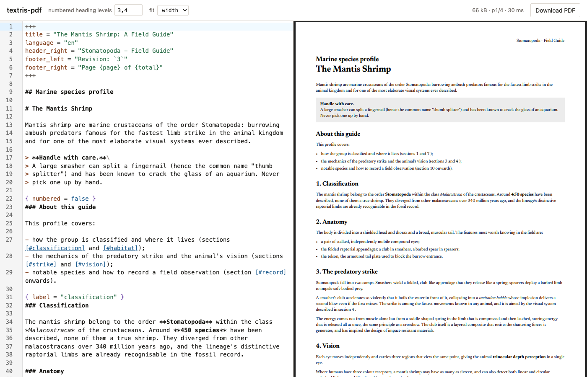

# textris-web-editor

A live editor for the [`textris-pdf`](..) Markdown dialect: type on the left,
see the rendered PDF on the right. The whole renderer — parsing, shaping,
layout and PDF serialization — runs in the browser as WebAssembly; nothing is
uploaded anywhere.



## Running it

```sh
cargo install trunk                    # once
rustup target add wasm32-unknown-unknown

trunk serve                            # http://localhost:8080, rebuilds on save
trunk build --release                  # or: a static site in dist/
```

Trunk fetches a matching `wasm-bindgen` and `wasm-opt` itself, so there is no
CLI version to keep in step with the `wasm-bindgen` crate. `dist/` is
self-contained and can be served by any static file host.

CodeMirror 6 loads as ESM from `esm.sh` through the import map in
[`index.html`](index.html), so there is no npm dependency and no bundler. Each
package pins its version and lists its CodeMirror peers as `external` so they
resolve back through that map — two copies of `@codemirror/state` in one page
break CodeMirror outright. To run fully offline, vendor the graph with
`npx esbuild main.js --bundle --format=esm --outfile=bundle.js` and point the
module script at the result.

## How it fits together

| File | Role |
| --- | --- |
| [`src/lib.rs`](src/lib.rs) | `wasm-bindgen` glue: font bytes in, PDF bytes out. No rendering logic. |
| [`main.js`](main.js) | Editor setup, debounced rendering, preview and error reporting. |
| [`dialect.js`](dialect.js) | CodeMirror syntax highlighting for the dialect. |
| [`index.html`](index.html) | Trunk asset directives and the import map. |

The editor calls `Renderer::render` on a 300 ms debounce after the last
keystroke. A render of the bundled sample takes about 6 ms once the font cache
is warm, so the delay is the debounce, not the renderer.

On failure the preview keeps showing the last good PDF, and the parse error —
which carries a 1-based line number but no column, matching
`MarkdownParseError` — is shown in the error bar and marked in the gutter.

## Following the edit

The preview scrolls to the page you are editing. That needs a map from source
lines to pages, which the library now provides in two halves:

- [`Textris::source_map`](../src/build/mod.rs) — the source line each parsed
  block came from, recorded by `push_markdown`;
- [`Layout::block_pages`](../src/layout/display.rs) — the page each top-level
  block started on, recorded by the layout engine.

The editor joins them and binary-searches for the last block starting at or
before the edited line. A block that spans a page boundary is recorded at the
page it *starts* on, so a cursor deep inside a long table maps to that table's
first page.

It follows the last **edit**, not the cursor. Re-pointing the viewer costs a
reload (see below), and paying that for every arrow key would flicker.

## Two things worth knowing

**The creation date is fixed per session.** `wasm32-unknown-unknown` has no
clock, so the page passes one in (`Document::created`, via
`Textris::created_at`). Pinning it for the session rather than reading
`Date.now()` per render also means an edit that does not change the layout
produces byte-identical output, which the preview uses to leave your scroll
position alone.

**The preview is the browser's own PDF viewer**, driven entirely through
Acrobat-style open parameters in the URL fragment:

| Parameter | Effect |
| --- | --- |
| `toolbar=0` | Removes the viewer's toolbar *and* its thumbnail sidebar, leaving only the page. |
| `navpanes=0` | Belt-and-braces for viewers that treat the sidebar separately. |
| `page=N` | Opens on page N — how the preview follows your edit. |
| `view=Fit` | Scales a whole page into view; omitted, the viewer fits to width. |

The catch: these are honoured only on the *initial* navigation to a blob URL.
Changing the fragment afterwards, by `src` or by `location.hash`, is silently
ignored. So re-targeting means minting a fresh blob URL, which reloads the
viewer — free on a re-render, since the bytes changed and the URL had to change
anyway, and why the preview is left strictly alone when the bytes, the page and
the fit all held still.

Two consequences worth knowing. The viewer briefly paints page 1 before
jumping to the target, so a fast eye catches a flash on documents of a few
pages. And because the toolbar is gone, so is the viewer's zoom control —
hence the `fit` selector in the toolbar, and the page counter in the status
bar. Rendering to a canvas with pdf.js would remove the reload entirely, at
the cost of about a megabyte of JavaScript.

All of this is verified in Chrome. Other browsers may ignore the parameters
and show their own chrome; nothing breaks if they do.

## Fonts

The bundled Newsreader and Fira Code variable fonts come from
[`tests/fonts/`](../tests/fonts), copied into `dist/` at build time. Both are
OFL-1.1 and their licences ship alongside them. `textris-pdf` embeds no
typeface of its own, so swapping them is a matter of pointing the `copy-file`
directives and the `FONTS` list in [`main.js`](main.js) somewhere else.
